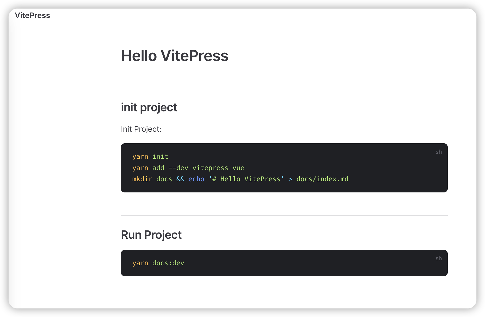

# Hello VitePress

## init project

Init Project:

```sh
yarn init 
yarn add --dev vitepress vue
mkdir docs && echo '# Hello VitePress' > docs/index.md
```

## Run Project

```sh
yarn docs:dev
```

## Start Writing

- Add something into markdown

## Website demo




Very Easy to setup.

## Setup Homepage

